# GoogleCloudAPIs.jl アーキテクチャ解説

このドキュメントは `GoogleCloudAPIs.jl` モノレポの**実装とアーキテクチャを完全に理解する**ことを目的とした技術解説です。各サブパッケージの責務、相互依存関係、リクエストのライフサイクル、認証フロー、テスト戦略まで、図表を用いて体系的に説明します。

> 対象バージョン: v0.1.0（main / `claude/repo-implementation-architecture-docs-gkisy` ブランチ時点）
> 関連: `README.md` (利用者向け) / `AGENT.md` (設計原則) / `Spec.md` (技術仕様) / `Testing.md` (テスト設計)

---

## 目次

1. [プロジェクト全体像](#1-プロジェクト全体像)
2. [モノレポ構造とパッケージ分割](#2-モノレポ構造とパッケージ分割)
3. [パッケージ依存関係](#3-パッケージ依存関係)
4. [レイヤードアーキテクチャ](#4-レイヤードアーキテクチャ)
5. [GoogleApiCore: 共通基盤層](#5-googleapicore-共通基盤層)
6. [GoogleAuth: 認証層](#6-googleauth-認証層)
7. [サービスクライアント共通パターン](#7-サービスクライアント共通パターン)
8. [GoogleCloudStorage](#8-googlecloudstorage)
9. [BigQuery](#9-bigquery)
10. [GoogleCloudPubSub](#10-googlecloudpubsub)
11. [リクエストライフサイクル（シーケンス図）](#11-リクエストライフサイクルシーケンス図)
12. [エミュレータと環境変数](#12-エミュレータと環境変数)
13. [CI/CD パイプライン](#13-cicd-パイプライン)
14. [セキュリティ設計](#14-セキュリティ設計)
15. [既知の制限と将来計画](#15-既知の制限と将来計画)

---

## 1. プロジェクト全体像

`GoogleCloudAPIs.jl` は **Google Cloud Platform (GCP) のクライアントライブラリ群を Julia ネイティブに実装したモノレポ**です。Python の `google-cloud-*` SDK と同等の機能を、Juliaの型システム・多重ディスパッチ・`Task`/`Channel` 並行モデルに即した形で提供します。

**設計上の中核原則** (`AGENT.md` より):

| 原則 | 具体的な現実 |
|------|--------------|
| **Performance First** | BigQuery 結果を `Arrow.Table` へ変換可能 (`format=:arrow`) |
| **Type Safety** | `Credentials` 抽象型 + `<: Credentials` の具体型ごとに `get_token` を多重ディスパッチ |
| **Idiomatic Julia** | `Base.iterate` でページネーション、`ReentrantLock` でトークンキャッシュをスレッドセーフ化 |
| **Cloud Native Security** | ADC → メタデータサーバ → OAuth の優先順、PKCE 必須、refresh_token はデフォルトでオンメモリ保持 |
| **AIP 準拠** | AIP-151 (LRO) / AIP-158 (Pagination) / AIP-193 (Errors) を `GoogleApiCore` 内に共通実装 |

---

## 2. モノレポ構造とパッケージ分割

```
GoogleCloudAPIs.jl/                          ← リポジトリルート（パッケージではない）
├── Project.toml                             ← 開発用 dev 環境のみ（モノレポ全体のテスト用）
├── docker-compose.yml                       ← GCS / Pub/Sub / BigQuery エミュレータ
├── README.md / AGENT.md / Spec.md / Testing.md / SECURITY.md
│
├── GoogleApiCore.jl/                        ← 共通インフラ（リトライ・ページング・LRO）
│   └── src/{GoogleApiCore.jl, retry.jl, pagination.jl, exceptions.jl, lro.jl, discovery.jl}
│
├── GoogleAuth.jl/                           ← 認証（ADC / SA / Metadata / OAuth）
│   └── src/{GoogleAuth.jl, credentials.jl, adc.jl, metadata.jl, browser.jl, oauth.jl}
│
├── GoogleCloudStorage.jl/                   ← GCS JSON API クライアント
│   └── src/{GoogleCloudStorage.jl, client.jl, buckets.jl, objects.jl}
│
├── BigQuery.jl/                             ← BigQuery REST API クライアント
│   └── src/{BigQuery.jl, client.jl, jobs.jl, datasets.jl, tables.jl, results.jl}
│
├── GoogleCloudPubSub.jl/                    ← Pub/Sub REST API クライアント
│   └── src/{GoogleCloudPubSub.jl, topics.jl, subscriptions.jl, messages.jl}
│
├── docs/                                    ← Documenter.jl ドキュメントソース
│   └── src/{index.md, auth.md, core.md, storage.md, bigquery.md, pubsub.md, contributing.md}
│
├── examples/                                ← 実 GCP プロジェクト向けのワークフロー例
│   └── 01_practical_workflow.jl             ← Auth → BQ → GCS → Pub/Sub の全機能デモ
│
├── test/runtests.jl                         ← 全サブパッケージを順次 Pkg.test
│
└── .github/workflows/                       ← CI（Aqua → エミュレータ起動 → 並列テスト）
    └── {CI.yml, Docs.yml, CompatHelper.yml, TagBot.yml}
```

**重要なポイント**:

- ルートの `Project.toml` は**パッケージではなく開発用環境**。`name` フィールドがない（`[deps]` のみ）。
- 各サブパッケージは**独立した Julia パッケージ**。それぞれ独自の `Project.toml` / UUID / バージョンを持つ。
- ユーザーは `Pkg.add(url=...; subdir="BigQuery.jl")` のように**個別にインストール**できる。
- `GoogleApiCore` は `GoogleAuth` および全サービスパッケージから依存される最下層。`GoogleAuth` も同様に全サービスから依存される。

---

## 3. パッケージ依存関係

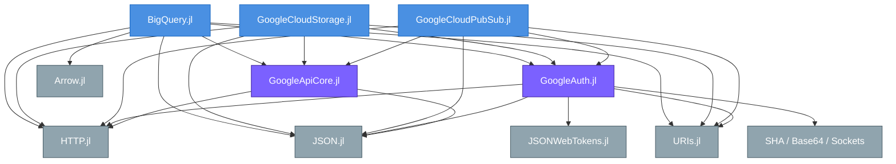

**依存方向の不変条件**:

- サービスパッケージ → `GoogleAuth` / `GoogleApiCore`（一方向、循環なし）
- `GoogleAuth` ↔ `GoogleApiCore`: **互いに依存しない**。`GoogleApiCore.do_request_with_retry` は認証ロジックを持たず、`sign!` コールバックで認証ヘッダを注入する設計（credential-agnostic）。
- 外部依存は全パッケージで HTTP.jl 1.x / JSON.jl / URIs.jl に統一されている（`Project.toml` の `[compat]` で固定）。

---

## 4. レイヤードアーキテクチャ

各サービスクライアントは下記の 3 層に分かれた呼び出しを行います。

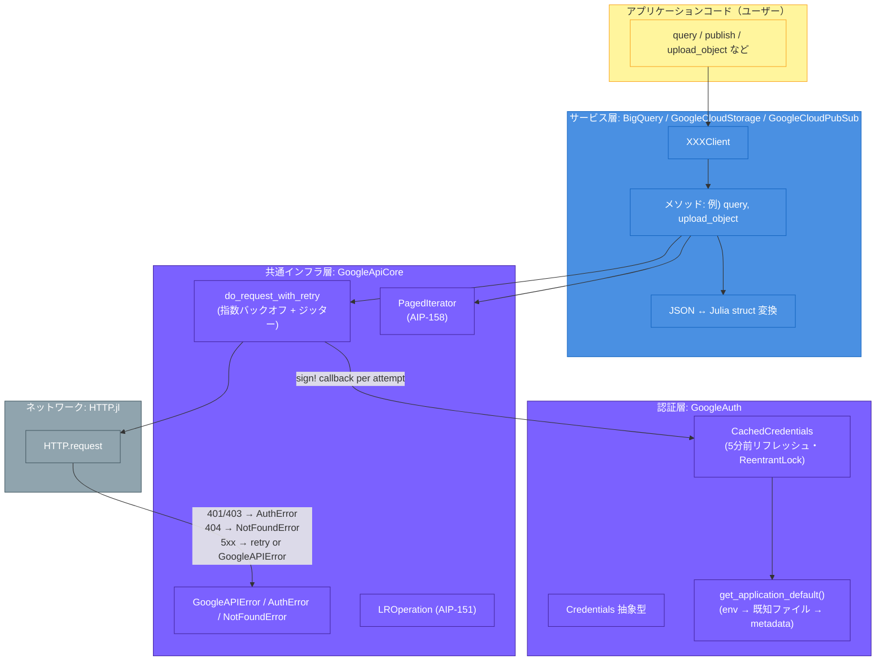

**重要な設計上の分離**:

1. **`GoogleApiCore` は認証を知らない**。`do_request_with_retry` には `sign!::(::HTTP.Request) -> Nothing` 引数があり、これがリトライごとに呼ばれて `Authorization` ヘッダを再注入する。
2. リトライごとに `HTTP.Request` を**再構築**することで、`CachedCredentials` がトークンをリフレッシュした際に**古いトークンを使い続けるバグを回避**している（コミット `2602653` の修正点）。
3. 各サービスクライアントは `_make_signer(client)` で `sign!` クロージャを生成し、エミュレータモードでは `nothing` を返す（認証不要モード）。

---

## 5. GoogleApiCore: 共通基盤層

`GoogleApiCore.jl/src/` は約 350 行・5 ファイル構成です。

### 5.1 モジュール構成

| ファイル | エクスポート | 責務 |
|----------|--------------|------|
| `GoogleApiCore.jl` | （エントリ）| `include` のみ |
| `retry.jl` | `RetryConfig`, `do_request_with_retry` | 指数バックオフ + リトライ判定 + 例外マッピング |
| `pagination.jl` | `AbstractPage`, `PagedIterator`, `get_items`, `get_next_token` | AIP-158 ページネーション |
| `exceptions.jl` | `GoogleAPIError`, `AuthError`, `NotFoundError` | サニタイズされた API エラー |
| `lro.jl` | `LROperation`, `wait_for_operation`, `cancel_operation`, `LROClient` | AIP-151 長時間処理（プロトタイプ段階） |
| `discovery.jl` | `Discovery.generate_api` | Google Discovery Service からの動的メソッド生成（プロトタイプ） |

### 5.2 リトライ FSM

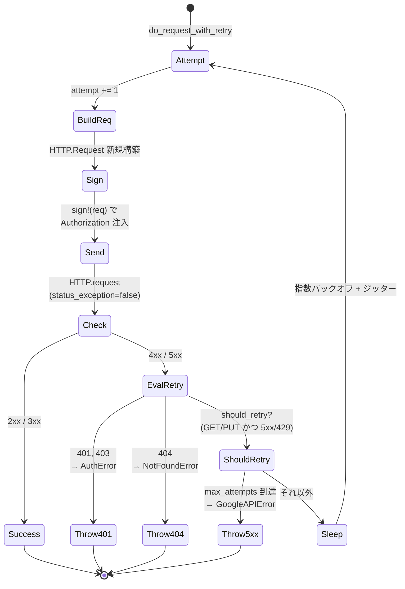

**リトライ判定の規則** (`retry.jl:should_retry`):

| HTTP メソッド | 5xx | 429 | 4xx (≠429) |
|---------------|-----|-----|------------|
| `GET`         | ✅ retry | ✅ retry | ❌ raise |
| `PUT`         | ✅ retry | ✅ retry | ❌ raise |
| `POST` 他     | ❌ raise | ❌ raise | ❌ raise |

**遅延計算**:

$$T_{\text{sleep}} = \min(\text{initial\_delay} \times \text{multiplier}^{\text{attempt}-1}, \text{max\_delay}) + \text{rand}() \times 0.1 \times \text{delay}$$

デフォルトは `1s → 2s → 4s → 8s → 16s`（最大 5 回、ジッター ±10%）。

### 5.3 ページネーション（AIP-158）

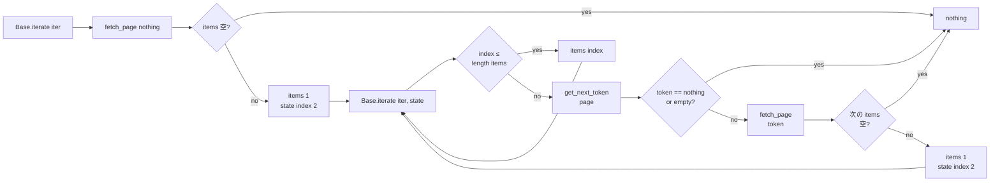

実装は `pagination.jl:99` 行に収まり、ユーザーは具体型に `<: AbstractPage` 宣言と `get_items` / `get_next_token` を実装するだけで `for x in iter` が動作します。

具体的なページ型 (`DatasetListPage`, `BucketListPage`, `ObjectListPage`, `TableListPage`, `TopicListPage`, `SubscriptionListPage`) は各サービスパッケージ内で定義されています。

### 5.4 例外階層

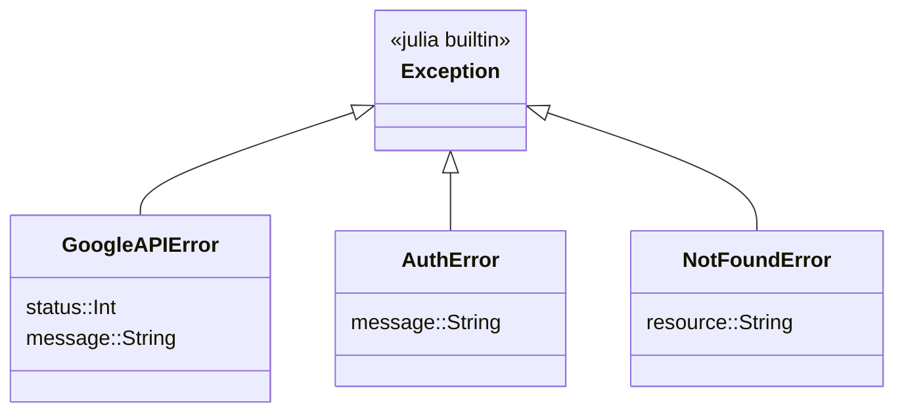

`_parse_api_error_body` (`exceptions.jl`) が `{"error":{"code","message","status"}}` 形式を解析し、生のレスポンスボディは漏らさず（先頭200文字までで切り詰め）、`error.code` / `error.message` / `error.status` の3フィールドのみ例外メッセージに含めます（**SEC-002**）。

---

## 6. GoogleAuth: 認証層

`GoogleAuth.jl/src/` は約 800 行・6 ファイル構成です。

### 6.1 Credentials 型階層

```mermaid
classDiagram
    class Credentials {
        <<abstract>>
        +get_token(creds)*
    }

    class Token {
        access_token::String
        expires_in::Int
        token_type::String
    }

    class ServiceAccountCredentials {
        project_id::String
        client_email::String
        private_key_id::String
        private_key::String
        token_uri::String
        scopes::Vector{String}
    }

    class UserCredentials {
        client_id::String
        client_secret::String
        refresh_token::String
        type::String
    }

    class ComputeCredentials {
        (empty)
    }

    class ImpersonatedCredentials {
        source::Credentials
        target_principal::String
        scopes::Vector{String}
        lifetime::Int
    }

    class CachedCredentials~C~ {
        inner::C
        _token::Token?
        _obtained_at::Float64
        _lock::ReentrantLock
    }

    Credentials <|-- ServiceAccountCredentials
    Credentials <|-- UserCredentials
    Credentials <|-- ComputeCredentials
    Credentials <|-- ImpersonatedCredentials
    Credentials <|-- CachedCredentials

    CachedCredentials *-- Credentials : wraps
    ImpersonatedCredentials *-- Credentials : source
```

各具体型は `get_token(c::ConcreteType)` を多重ディスパッチで実装します（`credentials.jl` / `metadata.jl`）。

| 型 | トークン取得方法 |
|----|------------------|
| `ServiceAccountCredentials` | JWT (RS256) を `JSONWebTokens.jl` で署名 → `urn:ietf:params:oauth:grant-type:jwt-bearer` を `token_uri` に POST |
| `UserCredentials` | `refresh_token` + `grant_type=refresh_token` を `oauth2.googleapis.com/token` に POST |
| `ComputeCredentials` | `http://metadata.google.internal/computeMetadata/v1/instance/service-accounts/default/token` に GET |
| `ImpersonatedCredentials` | `source` のトークン取得後、`iamcredentials.googleapis.com/.../generateAccessToken` を呼ぶ |
| `CachedCredentials{C}` | `inner` の `get_token` を呼んで結果を内部キャッシュ。残り5分以下になったら再取得（`ReentrantLock` で保護） |

### 6.2 Application Default Credentials (ADC) フロー

`get_application_default()` → `CachedCredentials` で包んで返します (`adc.jl:48`)。

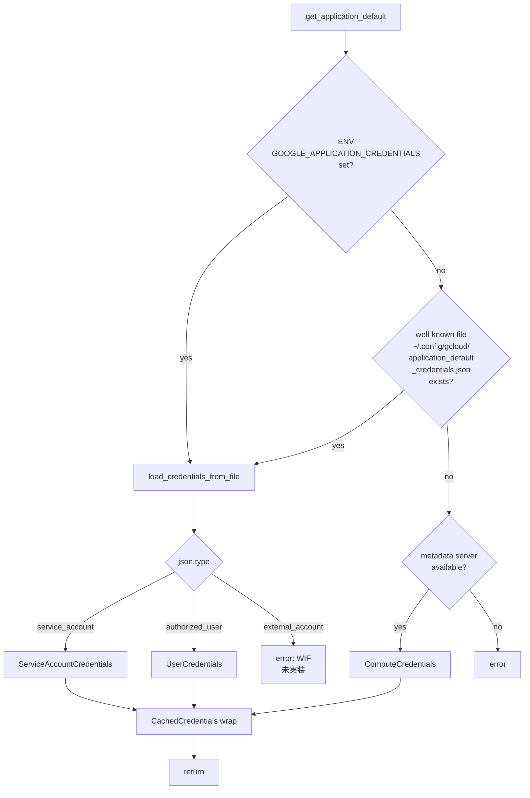

メタデータサーバ検出 (`metadata.jl:is_metadata_server_available`) は `connect_timeout=2s, readtimeout=2s, retry=false` で `metadata.google.internal` に到達できるか確認します（ローカル環境で長時間ハングしない）。

### 6.3 トークンキャッシュ（CachedCredentials）

```julia
function get_token(c::CachedCredentials)
    Base.@lock c._lock begin
        if c._token === nothing ||
           time() > c._obtained_at + c._token.expires_in - 300   # 5分前にリフレッシュ
            c._token = get_token(c.inner)
            c._obtained_at = time()
        end
        return c._token
    end
end
```

- `ReentrantLock` により**マルチスレッド環境でも安全**（`JULIA_NUM_THREADS=auto` の CI で並列テスト）。
- 300秒（5分）のリードタイムは Python の `google-auth` と同じ規約。
- `_token::Union{Token, Nothing}` なので、初回呼び出しまでは `nothing`。

### 6.4 OAuth Installed-App フロー（PKCE）

`authorize_via_browser` (`oauth.jl:209`) は Google が推奨する **Installed App with PKCE (RFC 7636)** を実装しています。

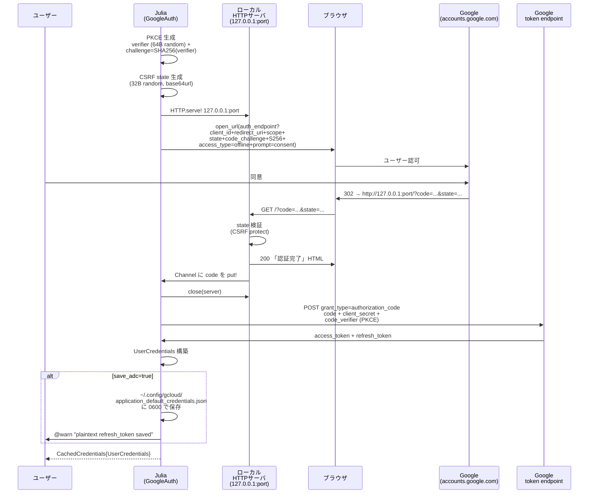

**セキュリティ対策**:
- ランダムなエフェメラルポートを使用（固定ポートを避ける）。**SEC-004**
- `state` パラメータ検証で CSRF 攻撃を防ぐ。
- PKCE により認可コード盗取攻撃を防ぐ。
- `timeout=60s` で待ち受け放置を防ぐ。
- `save_adc` のデフォルトは `false`。`true` のとき plaintext 保存への `@warn` を必ず発する（**SEC-003**）。
- `chmod 0o600` でファイル権限を制限（POSIX のみ）。

### 6.5 認証情報の `Base.show` 上書き

すべての credential 型は `Base.show` を上書きし、**秘密情報を `<redacted>` に置換**します（**SEC-001**）:

```julia
Base.show(io::IO, t::Token) =
    print(io, "Token(token_type=$(repr(t.token_type)), expires_in=$(t.expires_in), access_token=<redacted>)")

Base.show(io::IO, c::ServiceAccountCredentials) =
    print(io, "ServiceAccountCredentials(client_email=..., private_key=<redacted>)")

Base.show(io::IO, ::UserCredentials) =
    print(io, "UserCredentials(client_secret=<redacted>, refresh_token=<redacted>)")
```

REPL に誤って表示されてもログ/コピペで漏れない保証です。

---

## 7. サービスクライアント共通パターン

`GoogleCloudStorage` / `BigQuery` / `GoogleCloudPubSub` は**同一のパターン**で実装されています。

### 7.1 共通の構造体フィールド

| 型 | フィールド | 役割 |
|----|------------|------|
| `Client` (GCS) / `BQClient` / `PubSubClient` | `project_id` / `project` | プロジェクトID |
| 同上 | `creds::Union{Credentials, Nothing}` | エミュレータ時は `nothing` |
| 同上 | `endpoint::String` | 本番ホスト or エミュレータURL |
| 同上 | `is_emulator::Bool` | 認証スキップフラグ |
| `BQClient` のみ | `location::String` | BigQuery のジョブロケーション (`"US"` など) |

### 7.2 コンストラクタの分岐

すべてのクライアントが同じ判定をします:

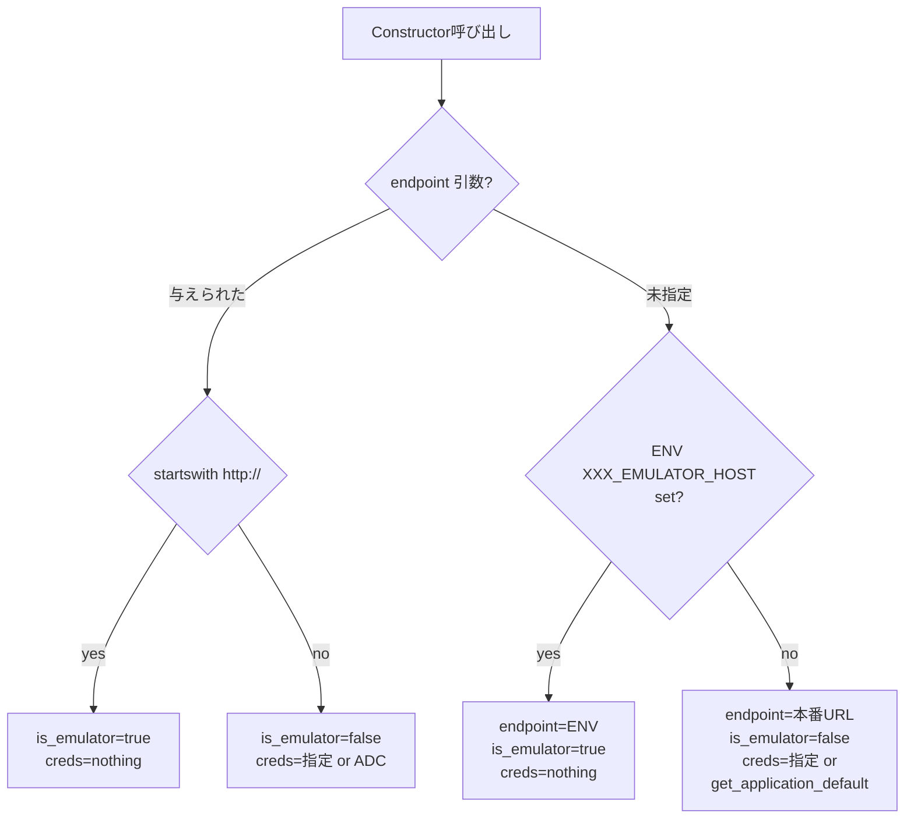

環境変数名はサービスごとに異なります:

| サービス | 環境変数 | 本番ホスト |
|----------|----------|------------|
| GCS | `STORAGE_EMULATOR_HOST` | `https://storage.googleapis.com` |
| BigQuery | `BIGQUERY_EMULATOR_HOST` | `https://bigquery.googleapis.com` |
| Pub/Sub | `PUBSUB_EMULATOR_HOST` | `https://pubsub.googleapis.com` |

### 7.3 `_make_signer` パターン

各クライアントは `sign!` クロージャを生成する内部ヘルパーを持ちます:

```julia
function _make_signer(client::XXX)
    if client.is_emulator || client.creds === nothing
        return nothing                              # 認証不要モード
    end
    creds = client.creds
    return req -> push!(req.headers,
                       GoogleAuth.authorization_header(creds))  # リトライごとに呼ばれる
end
```

これを `GoogleApiCore.do_request_with_retry(...; sign! = _make_signer(client))` に渡すことで、**リトライごとに `CachedCredentials` から最新トークンを取得**します。

### 7.4 内部 `_request` ヘルパー

各クライアントは薄いラッパー `_request(client, method, path; query, body, content_type)` を持ち、URL 構築・`Content-Type` ヘッダ付与・`do_request_with_retry` 呼び出しを集約します。これにより各メソッド（`list_buckets`, `query`, `publish` など）の実装が薄く保たれています。

---

## 8. GoogleCloudStorage

### 8.1 サービスマップ

| Julia関数 | HTTP メソッド | パス | 備考 |
|-----------|---------------|------|------|
| `list_buckets(client)` | GET | `storage/v1/b?project={p}` | `PagedIterator{Bucket}` 返却 |
| `get_bucket(client, name)` | GET | `storage/v1/b/{name}` | |
| `create_bucket(client, name; location, storage_class)` | POST | `storage/v1/b?project={p}` | |
| `delete_bucket(client, name)` | DELETE | `storage/v1/b/{name}` | |
| `list_objects(client, bucket; prefix)` | GET | `storage/v1/b/{bucket}/o` | |
| `get_object(client, bucket, name)` | GET | `storage/v1/b/{bucket}/o/{name}` | メタデータのみ |
| `download_object(client, bucket, name)` | GET | `storage/v1/b/{bucket}/o/{name}?alt=media` | body をバイナリ取得 |
| `download_object(client, bucket, name, io)` | 同上 | 同上 | `IO` ストリームに書き込み |
| `upload_object(client, bucket, name, data; content_type)` | POST | `upload/storage/v1/b/{bucket}/o?uploadType=media&name={name}` | simple upload only |
| `delete_object(client, bucket, name)` | DELETE | `storage/v1/b/{bucket}/o/{name}` | |

### 8.2 上書きディスパッチ例

`upload_object` は `Vector{UInt8} / AbstractString / IO` のいずれも受け付け、内部で `Vector{UInt8}` に正規化します（`objects.jl:84`）:

```julia
body = data isa IO ? read(data) :
       data isa AbstractString ? Vector{UInt8}(data) :
       data
```

`download_object` は二つのメソッドを定義し、戻り値の型を変えます:
- `download_object(...) -> Vector{UInt8}`
- `download_object(..., io::IO) -> Nothing` （bytes を `io` に書き込み）

---

## 9. BigQuery

### 9.1 サービスマップ

| Julia関数 | HTTP メソッド | パス |
|-----------|---------------|------|
| `query(client, sql; format, timeout_ms, max_results)` | POST | `bigquery/v2/projects/{p}/queries` |
| （内部）次ページ取得 | GET | `bigquery/v2/projects/{p}/queries/{jobId}?pageToken=...` |
| `list_datasets(client)` | GET | `bigquery/v2/projects/{p}/datasets` |
| `get_dataset(client, id)` | GET | `bigquery/v2/projects/{p}/datasets/{id}` |
| `create_dataset(client, id; location, friendly_name)` | POST | `bigquery/v2/projects/{p}/datasets` |
| `delete_dataset(client, id; delete_contents)` | DELETE | `bigquery/v2/projects/{p}/datasets/{id}` |
| `list_tables(client, ds)` | GET | `bigquery/v2/projects/{p}/datasets/{ds}/tables` |
| `get_table(client, ds, t)` | GET | `.../datasets/{ds}/tables/{t}` |
| `create_table(client, ds, t, schema)` | POST | `.../datasets/{ds}/tables` |
| `delete_table(client, ds, t)` | DELETE | `.../datasets/{ds}/tables/{t}` |

### 9.2 `query` の処理フロー

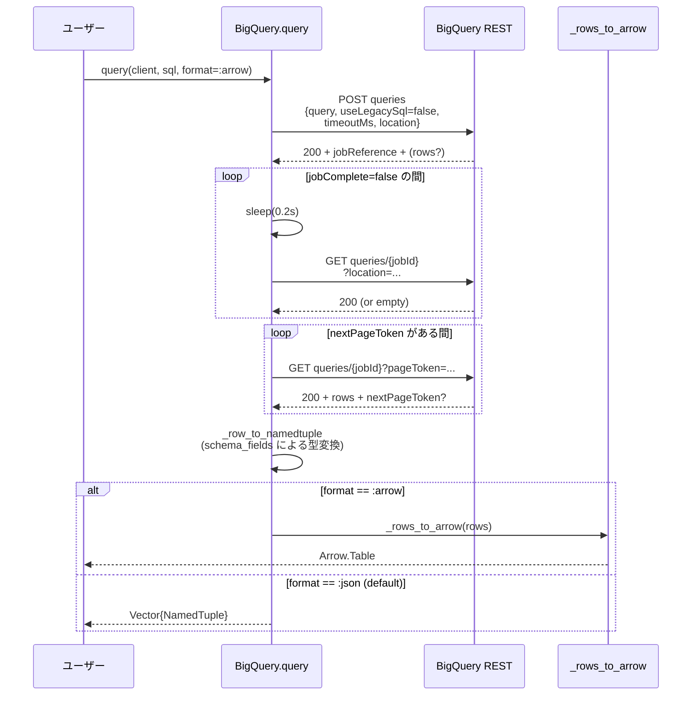

### 9.3 型変換規則 (`_coerce_value` / `results.jl`)

BigQuery REST はすべての値を `String` で返します。クライアントは型タグに基づいて変換します:

| BigQuery 型タグ | Julia 型 |
|----------------|----------|
| `INTEGER` / `INT64` | `Int64` (`parse`) |
| `FLOAT` / `FLOAT64` | `Float64` (`parse`) |
| `BOOLEAN` / `BOOL` | `Bool` (`parse`) |
| その他 (`STRING`, `TIMESTAMP`, etc.) | `String` のまま |
| `null` | `missing` |

### 9.4 Arrow 注意点

`format=:arrow` は**REST JSON レスポンスをサーバから取得した後でクライアント側で Arrow.Table へ変換**します（`_rows_to_arrow` / `results.jl:9`）。これは「columnar インターフェース」を提供しますが、**ゼロコピー Arrow ストリーミングではありません**。

真のゼロコピー Arrow は BigQuery Storage Read API（gRPC）が必要で、v0.1 には未実装です（将来 `GoogleBigQueryStorage.jl` パッケージとして追加予定）。

---

## 10. GoogleCloudPubSub

### 10.1 サービスマップ

| Julia関数 | HTTP メソッド | パス |
|-----------|---------------|------|
| `create_topic(client, id)` | PUT | `v1/projects/{p}/topics/{id}` |
| `get_topic(client, id)` | GET | 同上 |
| `delete_topic(client, id)` | DELETE | 同上 |
| `list_topics(client)` | GET | `v1/projects/{p}/topics` |
| `create_subscription(client, sub_id, topic_id; ack_deadline_seconds)` | PUT | `v1/projects/{p}/subscriptions/{sub_id}` |
| `get_subscription(client, sub_id)` | GET | 同上 |
| `delete_subscription(client, sub_id)` | DELETE | 同上 |
| `list_subscriptions(client)` | GET | `v1/projects/{p}/subscriptions` |
| `publish(client, topic_id, msg)` | POST | `v1/projects/{p}/topics/{id}:publish` |
| `pull(client, sub_id; max_messages, return_immediately)` | POST | `v1/projects/{p}/subscriptions/{sub_id}:pull` |
| `acknowledge(client, sub_id, ack_ids)` | POST | `v1/projects/{p}/subscriptions/{sub_id}:acknowledge` |

### 10.2 メッセージライフサイクル

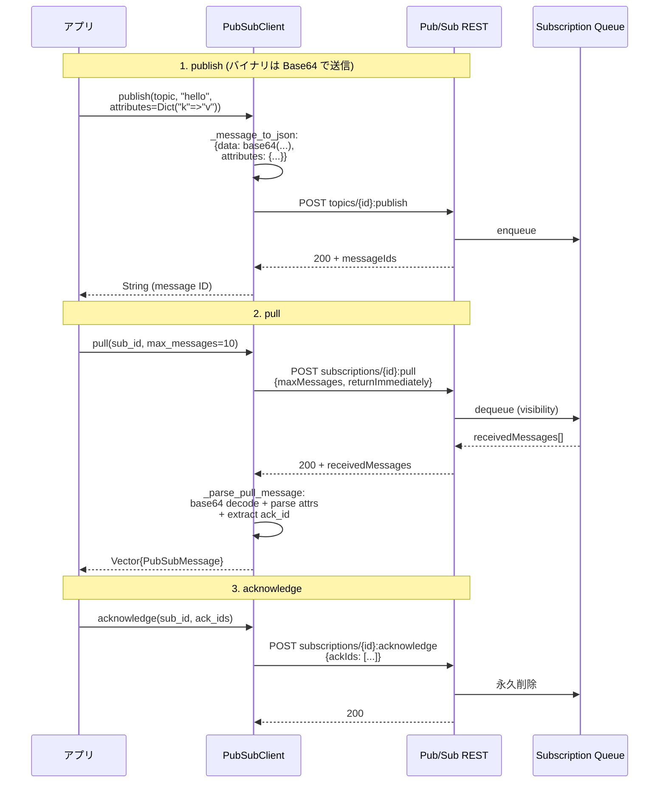

メッセージの `data` フィールドは Pub/Sub プロトコル仕様により**常に Base64 でエンコード/デコード**されます (`messages.jl:_message_to_json` / `_parse_pull_message`)。

### 10.3 publish の多重ディスパッチ

```julia
publish(client, topic_id, ::Vector{PubSubMessage}) -> Vector{String}     # バッチ
publish(client, topic_id, ::PubSubMessage)         -> String             # 単発（バッチに委譲）
publish(client, topic_id, ::Vector{UInt8}; attrs)  -> String             # バイナリ
publish(client, topic_id, ::AbstractString; attrs) -> String             # 文字列
```

すべて最終的に `Vector{PubSubMessage}` 版に集約されます。

---

## 11. リクエストライフサイクル（シーケンス図）

「ユーザーが `BigQuery.query(...)` を呼んだとき、何が起きるか」を**全レイヤを跨いだシーケンス**で示します。

```mermaid
sequenceDiagram
    autonumber
    participant U as ユーザー
    participant BQ as BigQuery.query
    participant REQ as _bq_request
    participant SIG as _make_signer<br/>(closure)
    participant CC as CachedCredentials
    participant CORE as GoogleApiCore.<br/>do_request_with_retry
    participant HTTP as HTTP.jl
    participant API as BigQuery REST

    U->>BQ: query(client, "SELECT 1")
    BQ->>BQ: body = JSON.json(<br/>{query, location, ...})
    BQ->>REQ: _bq_request("POST",<br/>"bigquery/v2/projects/.../queries",<br/>body=body)
    REQ->>SIG: build closure
    REQ->>CORE: do_request_with_retry<br/>(method, url, headers, body;<br/>sign! = closure)

    loop attempt=1..max_attempts
        CORE->>CORE: req = HTTP.Request(<br/>method, url, copy(headers), body)
        CORE->>SIG: sign!(req)
        SIG->>CC: GoogleAuth.authorization_header(creds)
        CC->>CC: check expiry (5min before)
        alt token expired or absent
            CC->>API: POST oauth2/token<br/>(SA JWT / refresh_token /<br/>metadata server)
            API-->>CC: new Token
        end
        CC-->>SIG: "Authorization" => "Bearer ..."
        SIG-->>CORE: push! to req.headers
        CORE->>HTTP: HTTP.request<br/>(status_exception=false)
        HTTP->>API: TCP/TLS
        API-->>HTTP: response

        alt 2xx
            HTTP-->>CORE: resp
            CORE-->>REQ: resp
        else 401/403
            CORE--xREQ: throw AuthError
        else 404
            CORE--xREQ: throw NotFoundError
        else 5xx/429 & GET/PUT & attempt < max
            CORE->>CORE: sleep(backoff + jitter)
            CORE->>CORE: continue loop
        else その他 4xx
            CORE--xREQ: throw GoogleAPIError
        end
    end

    REQ-->>BQ: HTTP.Response
    BQ->>BQ: JSON.parse(resp.body)<br/>schema 解析<br/>nextPageToken 追跡<br/>_row_to_namedtuple
    BQ-->>U: Vector{NamedTuple}
```

**重要な観察**:

- ステップ 5 で `req` は**毎回新しく構築**されるため、ステップ 7 でトークンが更新されていれば次の attempt では新しいトークンが使われる（コミット `2602653` のバグ修正）。
- ステップ 4 で `_make_signer` は**クロージャ**として `creds` をキャプチャしているため、`creds`（`CachedCredentials`）の内部状態が `_lock` 越しに共有される。
- BigQuery の `query` 自体は内部で複数回 `_bq_request` を呼ぶことがある（初回 POST → polling GET → nextPageToken の GET 群）。

---

## 12. エミュレータと環境変数

`docker-compose.yml` で 3 つのエミュレータを定義しています:

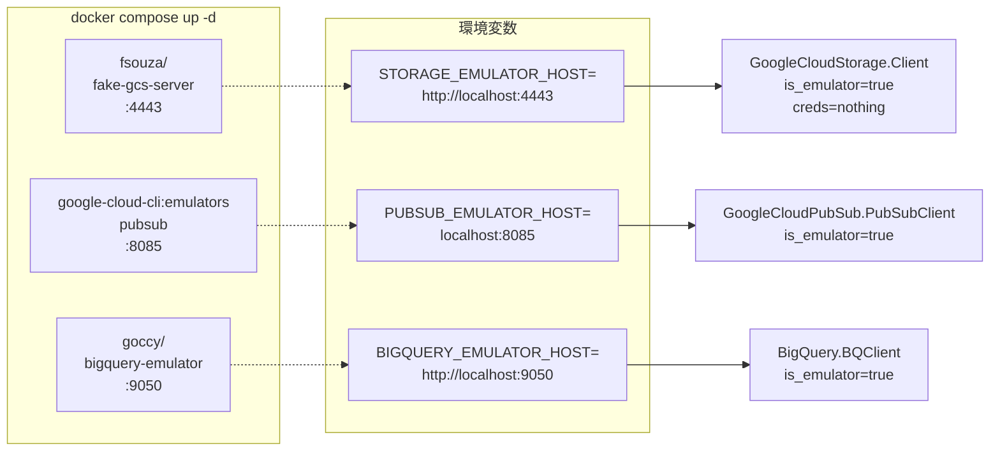

CI ジョブも同じ環境変数を export してエミュレータをジョブレベルで起動し（`CI.yml`）、各サブパッケージのテストはエミュレータに対して統合テストを実行します。

---

## 13. CI/CD パイプライン

`.github/workflows/` に 4 つのワークフローがあります。

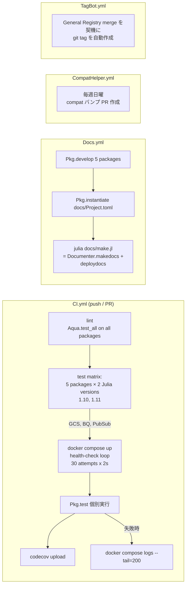

**テストマトリクスの規模**: `5 packages × 2 Julia versions = 10 並列ジョブ` 。`fail-fast: false` なので 1 ジョブが落ちても他は走り切る。

**Aqua.jl** は `test_all` で以下を検証 (`CI.yml:lint`):
- 依存関係の `[compat]` 漏れ
- 未使用依存
- 未エクスポート/誤エクスポート
- `Project.toml` の健全性
- `ambiguities=false` (多重ディスパッチの曖昧性は無効化)
- `persistent_tasks=false` (未登録パッケージなので無効化)

---

## 14. セキュリティ設計

`SECURITY.md` で文書化されているトレードオフ。設計時に考慮された4項目:

| ID | 内容 | 対策 |
|----|------|------|
| **SEC-001** | Credential の REPL/ログ漏出 | 全 credential 型で `Base.show` を上書きし `<redacted>` に置換 |
| **SEC-002** | エラーメッセージの payload 漏出 | `_parse_api_error_body` で `error.code/message/status` のみ抽出（先頭200文字でカット） |
| **SEC-003** | `save_adc=true` 時の refresh_token 平文保存 | デフォルト `false` / `chmod 0600` / `@warn` 必須 / 親ディレクトリ権限警告 |
| **SEC-004** | ローカル OAuth コールバックサーバ | `127.0.0.1` バインド / ランダムポート / `state` 検証 / 60秒タイムアウト / 一回限り |

セキュリティ脆弱性は GitHub Security Advisories から非公開で報告される設計です（5営業日 SLA）。

---

## 15. 既知の制限と将来計画

`AGENT.md` / 各 `README.md` および `Spec.md` に明示された範囲:

### 現状未実装（v0.1 で意図的に省略）

| 領域 | 制限 | 将来計画 |
|------|------|----------|
| BigQuery Storage Read API | gRPC 必要のため未実装 | `GoogleBigQueryStorage.jl` 別パッケージ |
| GCS Resumable Upload | simple upload (`uploadType=media`) のみ | v0.2 |
| GCS V4 Signed URLs | 未実装 | v0.2 |
| Pub/Sub Streaming Pull | pull のみ | 将来 |
| Pub/Sub Push / Ordering Keys / Dead Letter | 未実装 | 将来 |
| Workload Identity Federation | `external_account` JSON で `error` を投げる | 将来 |
| gRPC 全般 | REST のみ | `gRPCClient.jl` + `ProtoBuf.jl` で将来対応 |
| LRO (AIP-151) | スケルトン実装 (`lro.jl`) | 各サービスで本実装が必要 |
| Discovery Service コード生成 | プロトタイプ (`Discovery.generate_api`) | メタプログラミングで型安全メソッドを自動生成 |

### Spec.md が指定した実装フェーズ

1. **フェーズ1** ✅ `GoogleAuth.jl` の ADC とメタデータサーバ対応
2. **フェーズ2** ✅ `GoogleApiCore.jl` の AIP-158 ページネーション + 指数バックオフ
3. **フェーズ3** ✅ `GoogleCloudStorage.jl` プロトタイプ
4. **フェーズ4** ⚠️ `BigQuery.jl` の Arrow 高速読込（**現状は client-side 変換のみ。本来は Storage Read API gRPC**）

---

## 付録 A: ディレクトリ全体図（高解像度）

```mermaid
flowchart TB
    Root["GoogleCloudAPIs.jl/"]

    Root --> R1["Project.toml<br/>(dev env, no name)"]
    Root --> R2["docker-compose.yml"]
    Root --> R3["AGENT.md / Spec.md /<br/>Testing.md / SECURITY.md"]
    Root --> R4["README.md"]

    Root --> Core["GoogleApiCore.jl/"]
    Core --> C1["Project.toml<br/>uuid=5b46693f..."]
    Core --> C2["src/"]
    C2 --> C2a["GoogleApiCore.jl<br/>(entry)"]
    C2 --> C2b["retry.jl<br/>RetryConfig + do_request_with_retry"]
    C2 --> C2c["pagination.jl<br/>AbstractPage + PagedIterator"]
    C2 --> C2d["exceptions.jl<br/>GoogleAPIError + AuthError + NotFoundError"]
    C2 --> C2e["lro.jl<br/>LROperation (skeleton)"]
    C2 --> C2f["discovery.jl<br/>generate_api (prototype)"]

    Root --> Auth["GoogleAuth.jl/"]
    Auth --> A1["src/"]
    A1 --> A1a["credentials.jl<br/>(Token, SA, User, Compute,<br/>Impersonated, Cached)"]
    A1 --> A1b["adc.jl<br/>get_application_default"]
    A1 --> A1c["metadata.jl<br/>metadata.google.internal"]
    A1 --> A1d["browser.jl<br/>open_url"]
    A1 --> A1e["oauth.jl<br/>PKCE InstalledAppFlow"]

    Root --> GCS["GoogleCloudStorage.jl/"]
    GCS --> G1["src/<br/>{client, buckets, objects}.jl"]

    Root --> BQ["BigQuery.jl/"]
    BQ --> B1["src/<br/>{client, jobs, results,<br/>datasets, tables}.jl"]

    Root --> PS["GoogleCloudPubSub.jl/"]
    PS --> P1["src/<br/>{topics, subscriptions,<br/>messages}.jl"]

    Root --> Docs["docs/"]
    Docs --> D1["make.jl + src/*.md"]

    Root --> Ex["examples/<br/>01_practical_workflow.jl"]

    Root --> CI[".github/workflows/<br/>CI.yml + Docs.yml +<br/>TagBot.yml + CompatHelper.yml"]
```

## 付録 B: 関数呼び出し早見表

最頻出パスのまとめ:

| ユースケース | 呼び出し例 |
|--------------|------------|
| ADC でトークンを取る | `creds = GoogleAuth.get_application_default(); token = GoogleAuth.get_token(creds)` |
| Service Account をスコープ付きで使う | `CachedCredentials(with_scopes(sa, ["https://www.googleapis.com/auth/bigquery"]))` |
| ブラウザ OAuth | `creds = authorize_via_browser(client_id=..., client_secret=..., scopes=[...])` |
| BigQuery 単純クエリ | `rows = query(BQClient("p"), "SELECT 1")` |
| BigQuery → Arrow | `tbl = query(BQClient("p"), sql; format=:arrow)` |
| GCS アップロード | `upload_object(Client("p"), "bkt", "key", bytes; content_type="...")` |
| GCS ダウンロード（ファイルへ） | `open("local", "w") do io; download_object(c, "bkt", "key", io); end` |
| Pub/Sub 発行 | `publish(PubSubClient(project="p"), "topic", "hello")` |
| Pub/Sub 取得 + ack | `msgs = pull(c, "sub"); acknowledge(c, "sub", [m.ack_id for m in msgs])` |
| エミュレータ起動 | `docker compose up -d` + 環境変数 export |

---

このドキュメントを起点に、各サブディレクトリの `src/` を読めば実装の全貌を把握できます。詳細な API リファレンスは `docs/src/*.md`（Documenter.jl 生成）を参照してください。
